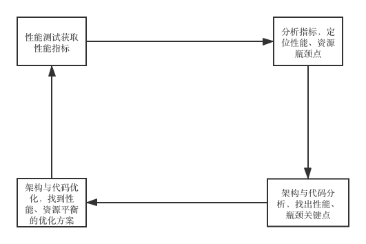

### 作业1. 性能压测的时候，随着并发压力的增加，系统响应时间和吞吐量如何变化，为什么？  
吞吐量=(1000/系统响应时间)*并发数，在系统响应时间不变的情况下，并发压力和吞吐量是成正比的。  
系统响应时间受系统资源使用情况影响，在并发压力增加时，系统资源的使用往往会增加，资源竞争产生的开销也会增加。如数据库连接的上限是100，在数据库操作并发大于100时，如果没做削峰填谷，就会有线程阻塞在获取数据库连接上，从而增加了系统响应时间。  
当然，设计良好的系统，在并发增加时，会做削峰填谷和快速伸缩，尽量使资源使用变化影响系统响应时间的程度变小。  
无论如何，并发压力和系统响应时间一般是成正比的，但程度由系统设计决定。  

### 作业2. web性能压测工具。  
[WebPerformanceTestingTool](code/WebPerformanceTestingTool.java)   
[测试入口](code/Testing.java)  
[测试结果](code/output.md)

### 总结  
了解一个系统的运行情况必须进行性能测试，而且要形成一个测试、分析、优化的闭环。其本质是找出系统中存在的问题，准确定义了问题域，问题其实就解决了一大半，还是一个问题导向思维。  
   

以水平方向看性能优化  
    - 机房和骨干网络优化  
        - 建立异地数据中心  
        - 专线网络  
    - 服务器硬件优化  
        - 使用更强大的CPU、更快的存储、带宽更大的网卡、更大更快的内存  
    - 操作系统优化  
        - 调整操作系统设置，减少系统调度开销  
    - 虚拟机优化 
        - 使用STW更少的GC  
    - 组件优化  
        - 升级组件版本  
        - 更换同类的其他组件  
    - 软件架构优化  
        - 缓存  
        - 异步  
        - 集群  
    - 软件代码优化  
        - 组织、逻辑清晰的代码结构  
        - 使用并发  
        - 资源复用  
        - 使用异步  
        - 使用合适的数据结构和组件  
以垂直方向看性能优化，主要围绕四大金刚来进行：CPU、内存、磁盘IO和网络。  
    - CPU  
        - 使用核心线程数更高的CPU，提升并行能力  
        - 使用运算能力更强的CPU   
        - 合理使用CPU，尽量用业务线程打满CPU，减少CPU空闲，但也不要超过CPU的处理能力  
    - 内存  
        - 使用读、写性能更加的内存    
        - 使用更大的内存，尽量让计算在内存中进行，减少磁盘IO  
        - 合理使用内存做数据缓存，减少不必要的磁盘IO  
    - 磁盘IO 
        - 尽量做批量数据读写，减少IO次数  
        - 合理使用异步线程做磁盘IO，减少阻塞在磁盘IO上的线程数量  
        - 使用数据缓冲，减少磁盘IO次数  
    - 网络  
        - 使用带宽更大的网络，提升网络吞吐量  
        - 使用带宽更高的网卡，提升网卡的吞吐量  
         
        
