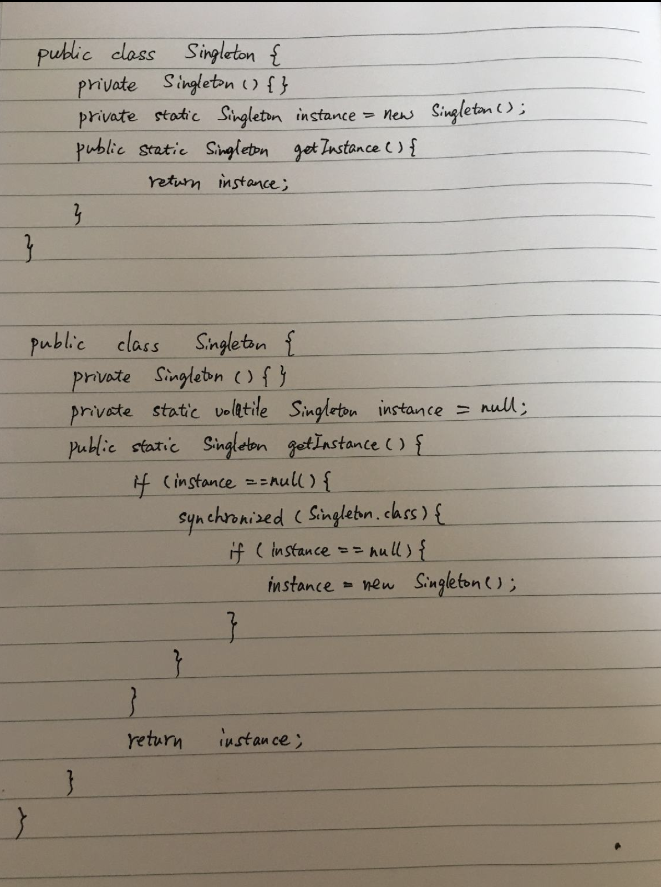

#  作业

##  1. 手写Singleton。



## 2. 请使用组合模式编写程序，打印图一窗口，窗口组件的树状结构
客户端：[client](Client.java)  
组件：[components](windows)  
运行结果：
```java
"/Applications/IntelliJ IDEA.app/Contents/jbr/Contents/Home/bin/java" -javaagent:/Applications/IntelliJ IDEA.app/Contents/lib/idea_rt.jar=53435:/Applications/IntelliJ IDEA.app/Contents/bin -Dfile.encoding=UTF-8 -classpath /Users/i320903/Documents/code/architecture-training-camp/out/production/architecture-training-camp Client
加载组件 [Window窗口]
加载组件 [LOGO图片]
加载组件 [登录按钮]
加载组件 [注册按钮]
加载组件 [frame1]
加载组件 [用户名]
加载组件 [文本框]
加载组件 [密码]
加载组件 [密码框]
加载组件 [复选框]
加载组件 [记住用户名]
加载组件 [忘记密码]

Process finished with exit code 0
```

#  总结

##  一、 设计模式
  
###  单例模式
- 什么是单例模式？  
    - 单例模式是指一个类有且仅有一个实例，并自行实例化向系统提供。  
- 单例模式有什么好处？  
    - 对于全局仅且必须只维护一个实例的场景，单例模式可以避免被系统其它类多实例化。  
    - 单例模式将实例创建的过程封装在类内部，仅提供访问已初始化的实例的静态方法，易于系统其它类获取并使用该实例。  
- 单例模式的要点：
    - 必须有private的构造函数，因为要阻止被其它类继承和实例化。  
    - 必须有一个private的静态实例和一个静态getInstance方法。  
    - 实例被提供给外部使用前必须已经完整初始化。  
    - 内部创建实例的过程必须是线程安全的。  
- 内部创建实例的几种变形和适用场景：
    - 懒汉模式：
        - 在定义private静态实例时直接初始化。  
        - 直接初始化会增加类加载的时间，因为类加载时会执行静态实例的初始化。故在启动时间不敏感的情况，或者静态实例创建不耗时的情况下比较适用。  
    - 饿汉模式：
        - 在定义private静态实例时不初始化，而是在getInstance方法被调用的时候才初始化。  
        - 节省了类加载的时间，但会面临线程安全问题，可以用同步来解决。适用启动时间敏感，或静态实例初始化很耗时的情况。  
        - 也可使用private静态类来避免过早初始化，也能避免线程安全问题，是比较好的方式。  
- 代码：
    - [Singleton_starving](singleton/Singleton_starving.java)  
    - [Singleton_lazy](singleton/Singleton_lazy.java)  
    - [Singleton_graceful](singleton/Singleton_graceful.java)  
    - [Singleton_enum](singleton/Singleton_enum.java)  

###  适配器模式  
- 什么是适配器模式？
    - 


###  策略模式  
- 什么是策略模式？  


###  
    
   