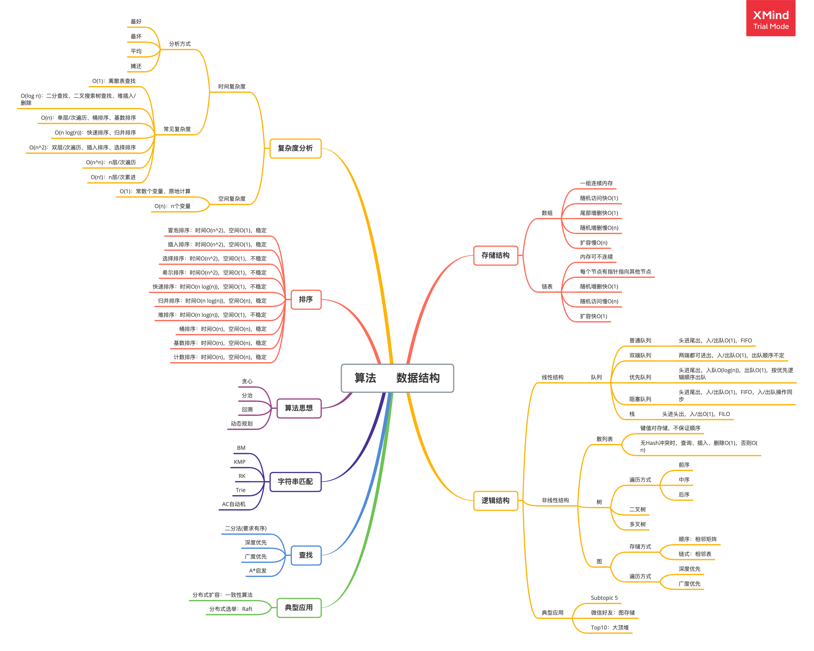

###  作业1. 判断两个单向链表是否有交集。
思路：
1. 用循环链表m中的元素，去链表n中遍历查找是否有相同的元素，有的话则有交集，否则没有。  
   时间复杂度：两层循环，故O(m*n)   
2. 交替遍历链表m和n，将遍历过的元素放到哈希表中，并在遍历时判断，被遍历的元素是否在哈希表中，如果在，则有交集，直到两个链表都遍历完。  
   时间复杂度：最坏情况，最后一个元素有交集，故O(m+n)   
````java
    public static boolean isOverlap (Node m, Node n) {
        if (m == null || n == null) return false;
        Map<Node, Node> nodeMap = new HashMap();
        int c = 0;
        while (true) {
            if (m == null && n == null) break;
            if (c++%2 == 0) {
                if (m != null) 
                    if (nodeMap.get(m) != null) return true;
                    else nodeMap.put(m, m);
                    m = m.next;
            } else {
                if (n != null) 
                    if (nodeMap.get(n) != null) return true;
                    else nodeMap.put(n, n);
                    n = n.next;
            }
        }
        return false;
    }
````


###  总结  
关于数据结构与算法，自己画了张脑图，归纳了自己的认知树。   


